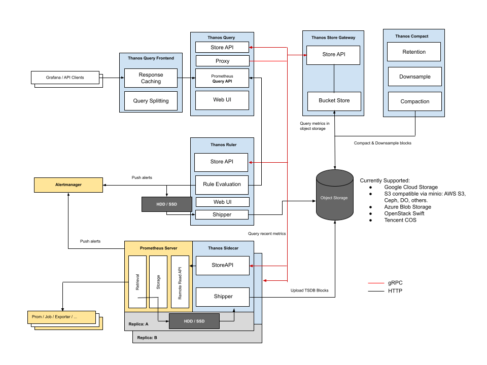

# Monitoring K8s multi-cluster multi-cloud side-project

## Description
Monitoring K8s using Thanos sidecar solution

## Architecture: Reference from Thanos community repository

## Completed
- Thanos sidecar design and architecture
- K8s manifest deployment 

## In-progress
- Deploy Object storage
- Auto provisioning by Terraform
- Init Grafana Charts and Alerts
- Deployment step-by-step guide

## License
Distributed under the MIT License. See [LICENSE](./LICENSE) for more information.
